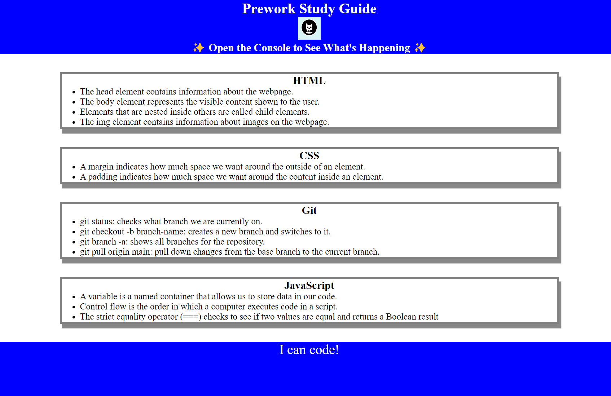

# Prework Study Guide Webpage

## Description

This project was created to structure the bootcamp prework notes on a webpage. It allows the user to easily find and read the notes. I learned to work with basic HTML, CSS, and JavaScript functionality.

## Installation

N/A

## Usage

To use this application you can locate the section of interest on the page and review the notes contained in the box. For suggestions on what to study first, open the Chrome DevTools by pressing Command+Option+I (macOS) or Control+Shift+I (Windows). A console panel should open either below or to the side of the webpage in the browser. There you will see a list of topics we learned from the prework along with a suggestion on which topic to study first.

## Credits

N/A

## License

Please refer to the LICENSE in the repo.
